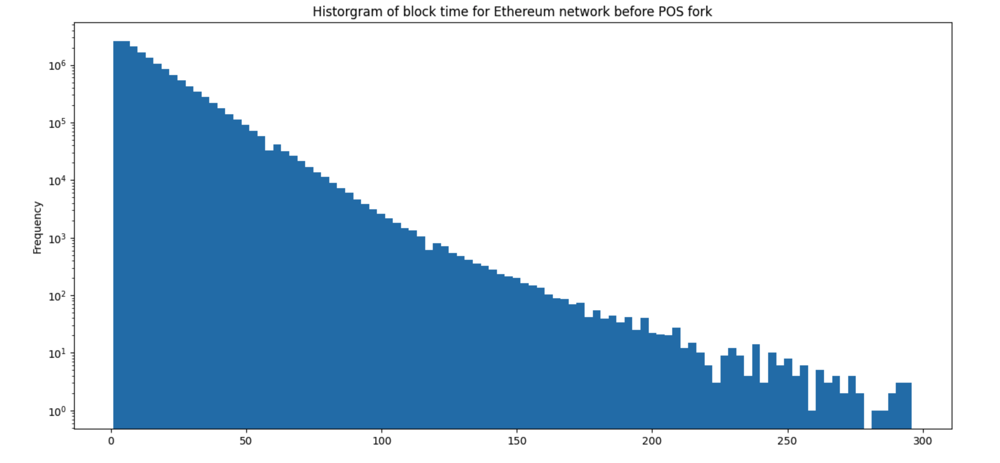
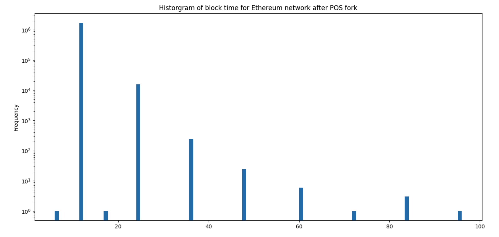
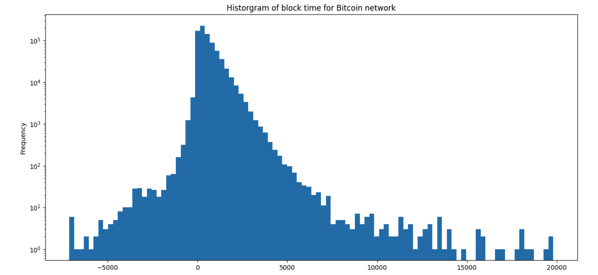
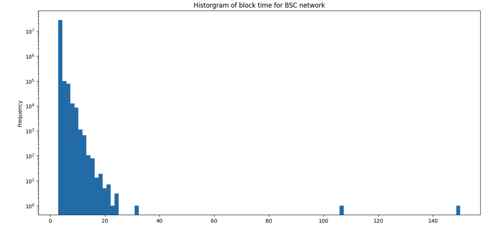
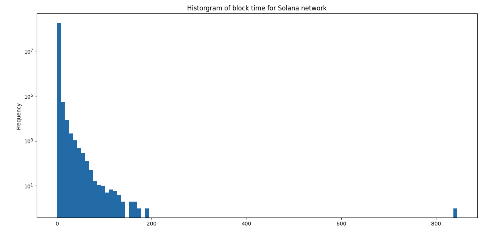

# Analysis of Blockchain Availability Based on Block Lag 

*Aleksey Studnev, Bitquery.io,
16 May, 2023*

Analysis of the on-chain data for 4 networks ( Bitcoin, Ethereum, Solana, Binance Smart Chain)
to calculate some statitics over the block time ( time between blocks being mined / inserted in the chain).

The data is taken from the [Data Sets](#data-sets) and processed using Pandas tools
using [Jupyter Notebook](#jupyter-notebook), published in the [github project](https://github.com/bitquery/blockchain-time.git).


## Why Block Lags Matter?

The goal for this analysis is to measure how well blockhain networks of different kind meet client
expectations on availability and speed. This is not just defined by the mean statistics, as average block time and
transactions per second. The distribution of these parameters is also important, and especially the  corner cases
of unexpectedly long lags in block times. 

When the blockchain network does not add the new block for a long time, all applications that are elying on that network,
efffectively stalled. It is equivallent to the program hangs on your computer. Blockchain clients,
as wallets or DApps, can not execute transactions, make transfers or smart contract calls.

Too long time lag between the blocks is equivalent to the service outage of the blockchain network. 
Here we tried to measure how often this happens and how severe it is in different blockchains.

Here we consider outage when the next block does not appear in 10x time interval from the average block period.
For example, if average period in Ethereum is 14 seconds, we consider 140 seconds as outage. This is calculated
relative to the average values, because the expectations of the clients ( both humans and applications ) are adapted
to the average block times, which are very different across blockchain networks.

## Aggergated Statistics on Block Times 

Here is the agregated statistics of the 4 blockchain networks under consideration:

| Network             | Average Block Time, sec | Median, sec |      Max, sec |
|---------------------|:-----------------------:|------------:|--------------:
| Ethereum Before POS |          14.47          |          10 |         13013 |
| Ethereum After POS  |          12.11          |          12 |            96 |
| Bitcoin             |           573           |         400 |        463160 |
| Binance Smart Chain |            3            |           3 |        26276  |
| Solana              |          0.56           |         0.5 |        122245 |

Ethereum is separated on 2 cases: before POS fork and after it, as statistics differs significantly.

The evident fact from the table is that the max time can significantly exceed the average figures and sometimes
they also exceed hours and even days.

We next will investigate each chain separately and after will come back to SLA figures alltogether

## Ethereum Before POS

The distribution of the block time in Ethereum Before POS ( logarithmic frequency scale ):



The hystogram in logarithmic scale looks very smooth and has almost 
linear slope for a range of 10..120 seconds per block.

It can be approximately modeled as of exponential decay:

```
Freq ~ A * exp ( -t * B )
```

Proof of work requires the guessing of crypto puzzle, which is a random
guessing, which must follow the Binomial distribution. We see here the trail 
of this distribution with t >> average(t), average is approximately 14 seconds.

It means, that any POW consensys by-design assumes the outages, when the block time due to 
probabalistic reasons exceed some pre-defined value.

On this diagram, the 140 seconds ( 14 sec avg x 10 factor) lies in the middle,
showing quite a lot of blocks, which took more time than that to mine.

There are also several blocks with the lag exceeding 300 sec:

```
ethereum[(ethereum['lag']>300)  & (ethereum['block']<15537393)]
```

gives us the blocks with extreme block times:

```
block	lag
116522	13013
4301233	315
4319473	311
4332544	303
4335240	312
4362431	440
4367071	346
4367313	309
```

Good news, that all of them well in the past!

## Ethereum After POS

The distribution of the block time in Ethereum After POS ( logarithmic frequency scale ):



Here we see very discrete histogram, with block times of multiples of  6 and 12 seconds.

The maximum time is 96 = 12 * 8, minimum is 6 seconds.


## Bitcoin

The distribution of the block time in Bitcoin ( logarithmic frequency scale ):



Bitcoin has similar POW type of block mining as Ethereum, thats why we see very similar slope 
towards large values.

Remarkable is quite significant negative range of block times. They originated from
the fact, that we took block **mining time** as a timestamp, and not the actual time when the block
was included in the blockchain. Mining times can be set well before the block was included in the chain
in reality, that's why we see quite a lot of blocks with negative lags.

However they should not significantly affect the measurement of the block lags in a positive range,
as their distribution falls much faster than positives.

There are 151 blocks, which took more than 2 hours to mine, and some took more than 10 hours:

```
block	lag
15	87157
15324	90532
16564	90390
16592	73782
19722	37536
19724	47127
20189	60203
21438	38219
```

Note that these are all at the very beginning of the network... good times!

## Binance Smart Chain

The distribution of the block time in Binance Smart Chain ( logarithmic frequency scale ):



BSC distribution falls pretty fast, and there are no much extremely long block times here.

## Solana

The distribution of the block time in Solana ( logarithmic frequency scale ):




Solana is famous for the very fast block times... and long outages!

These are blocks that took over 10 minutes:

```
block	lag
1690557	24831.334
13391978	25279.000
16903262	30648.500
53180905	16415.334
53180945	845.000
53180946	3345.000
60912004	122245.500
66528004	71496.500
96542813	38793.000
131973978	8665.500
136512012	16029.000
153139236	33098.000
179526406	69544.500
```

And you see, they are sometimes close to the whole day (!) when the network effectively stalled.

## Aggregated Availability Figures

The aggregated figures from the distributions are collected in the following table:

| Network             | Alert Block Time, sec | Availability % | Outage Time, Hours |
|---------------------|:---------------------:|---------------:|-------------------:
| Ethereum Before POS |          140          |          99.83 |                109 |
| Ethereum After POS  |          120          |            100 |                  0 |
| Bitcoin             |         5700          |          99.19 |               1023 |
| Binance Smart Chain |          30           |          99.97 |                7.6 |
| Solana              |           5           |          97.67 |                645 |


Binance Smart Chain and Ethereum After POS are favorites in terms of availability,
very close to 100%. It means the high predictability of application performance.

Solana is probably the fastest and less predictable network with just 97 % of availability,
which is not good even for centralised non-redundant systems ( single server web-site ).

## Data Sets

The data for inter-block lags in seconds versus the block number are quieried
from Bitquery datasets for 4 blockchains.

They are available in S3 public :


* [Binance Smart Chain](https://blockchain-time-data.s3.amazonaws.com/bsc_block_time.csv.gz)
* [Ethereum Mainnet](https://blockchain-time-data.s3.amazonaws.com/ethereum_block_time.csv.gz)
* [Bitcoin](https://blockchain-time-data.s3.amazonaws.com/btc_block_time.csv.gz)
* [Solana Mainnnet](https://blockchain-time-data.s3.amazonaws.com/solana_block_time.csv.gz)

## Jupyter Notebook

Jupyter notebook is in the [github project](https://github.com/bitquery/blockchain-time.git).
To run the code, you will need standard Jupyter labs installation, and download the datasets in data folder inside the prject

After that run
```
% jupyter-lab
```

and load notebook BlockhainTimes.ipynb

